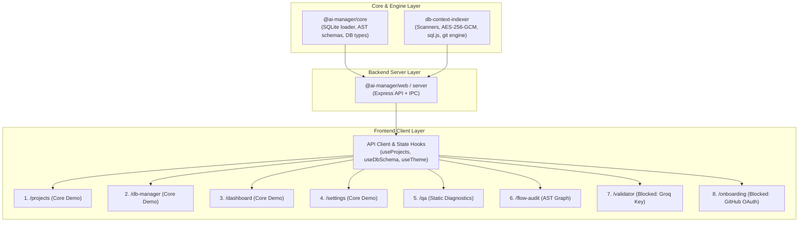

# Implementation Plan: AI Manager Full Functional Transition

This plan details the migration of `packages/ai-manager-web` from static UI mocks to fully functional, live-state components connected to the `@ai-manager/core` and `@ai-manager/db-context-indexer` engines.

---

## 1. System Architecture & Dependency Graph

### Academic Sem-7 Prioritized Execution Strategy
- **Per-Feature Mock Removal**: Mock data is removed **per-feature** only when its backend endpoint and state hook are live and tested. Unmigrated screens retain visual structure so the app remains fully demonstrable throughout development.
- **Priority Tier 1 (Core Working Demo & Grading Milestone)**:
  1. `/projects` & Project Switcher: Real project creation, directory list, and active project state.
  2. `/db-manager`: Real SQLite schema tree loading via `sql.js` and live interactive SQL query execution.
  3. `/dashboard`: Dynamic stat cards and recent activity computed from active project's DB index.
  4. `/settings`: Real AES-256-GCM encrypted key storage and local data reset.
- **Priority Tier 2 (Static Codebase Diagnostics)**:
  5. `/qa`: Rule-based schema diagnostics and health checks (unindexed FKs, missing tables).
  6. `/flow-audit`: AST function call graph inspector from local `ts-morph` index.
- **Priority Tier 3 (Deferred / Credential-Blocked Backlog)**:
  7. `/validator` LLM execution: Blocked until `GROQ_API_KEY` is provided.
  8. `/onboarding` GitHub OAuth: Blocked until `GITHUB_CLIENT_ID` / `GITHUB_CLIENT_SECRET` are configured (offline local path onboarding is prioritized).

---

## 2. Screen-by-Screen Implementation Specifications

### 2.1 `/onboarding` — Project Onboarding & Setup

| Feature | Backend / Data Source | Concrete Implementation Approach | Dependencies | Complexity |
|---|---|---|---|---|
| **GitHub OAuth Connect** | `packages/ai-manager-web/server/auth.ts` | Endpoint: `GET /api/auth/github` + `GET /api/auth/github/callback`. Uses Octokit / GitHub OAuth App credentials to exchange code for token and store via AES-256-GCM. | Settings Key Storage | Medium |
| **Local Path Browse & Validate** | `packages/ai-manager-web/server/projects.ts` + `fs` | Endpoint: `POST /api/projects/validate-path`. Accepts `{ path }`, verifies folder exists, checks for `package.json` / git repo / DB configs, and returns folder structure metadata. | Core File Utilities | Small |
| **Index Repository Trigger** | `packages/db-context-indexer` (`runScan`) | Endpoint: `POST /api/projects/index-repo`. Initiates AST indexer scanner across TypeScript/Python codebase, creates `.dbci/index.sqlite`, and returns job progress SSE stream. | AST Scanners | Large |

---

### 2.2 `/dashboard` — Platform Home & Metrics

| Feature | Backend / Data Source | Concrete Implementation Approach | Dependencies | Complexity |
|---|---|---|---|---|
| **Live Stat Numbers** | `@ai-manager/db-context-indexer` (`loadIndexFromSqlite`) | Endpoint: `GET /api/dashboard/stats?project=:id`. Returns dynamic counts: `queriesCount`, `tablesCount`, `healthPercent`, `unresolvedCount`, `edgesCount`. | SQLite Loader | Small |
| **Live Recent Activity Feed** | SQLite DB (`discussions`, `proposals`, `scans`) | Endpoint: `GET /api/dashboard/activity?project=:id`. Queries latest scan runs, migration diffs, and validation passes in chronological order. | SQLite Loader | Medium |
| **"New Project" Button** | `ai-manager-web/server/projects.ts` | Action: Opens project creation modal; calls `POST /api/projects` to register new project workspace. | Project Registry | Small |
| **"Run Indexer" Button** | `packages/db-context-indexer` (`runScan`) | Action: Calls `POST /api/projects/:id/scan`; triggers instant AST re-scan with progress notification. | Indexer Engine | Medium |
| **"View Logs" Button** | Server Logger / SSE stream | Action: Opens log drawer or navigates to `/qa` filtered on active scan logs. | QA Log Stream | Small |

---

### 2.3 `/projects` & `/projects/:id` — Projects Directory & Detail

| Feature | Backend / Data Source | Concrete Implementation Approach | Dependencies | Complexity |
|---|---|---|---|---|
| **New Project Creation** | `packages/ai-manager-web/server/projects.ts` | Endpoint: `POST /api/projects`. Body: `{ name, rootDir, dbType, gitRemote }`. Persists to local projects registry file (`.ai-manager/projects.json`). | Settings / Auth | Medium |
| **Real Project Stats from DBCI** | `@ai-manager/db-context-indexer` | Endpoint: `GET /api/projects`. Iterates registered projects, inspects each `.dbci/index.sqlite` and git HEAD, returning live health score, last indexed time, and query count. | DBCI Scanner | Medium |
| **Project Detail View (`/projects/:id`)** | New Route + Component `ProjectDetailPage.tsx` | Route: `/projects/:id`. Displays project-scoped DB manager tabs, quick query console, AST validation health, and recent git commits for that specific project. | Project Registry | Large |

---

### 2.4 `/db-manager` — Database Schema & Query Tool

| Feature | Backend / Data Source | Concrete Implementation Approach | Dependencies | Complexity |
|---|---|---|---|---|
| **Live Schema Tree** | `@ai-manager/core` + `sql.js` | Endpoint: `GET /api/db/schema?project=:id`. Reads sqlite tables, column definitions, data types, primary/foreign keys from `index.sqlite` and target schema. | sql.js Engine | Medium |
| **Live Run Query Execution** | `sql.js` (WASM SQLite) / Target DB Driver | Endpoint: `POST /api/db/query`. Body: `{ query, project, limit }`. Executes query safely in sandbox, returns real row records, execution time (`ms`), and column metadata. | sql.js Engine | Medium |
| **Working Pagination** | Server Query Runner / Slice buffer | Handles `page` and `pageSize` parameters in `POST /api/db/query` returning `{ rows, total, page, totalPages }`. | Run Query | Small |
| **Export Schema** | `ai-manager-web/server` Schema Serializer | Endpoint: `GET /api/db/export?project=:id&format=sql|json`. Dumps DDL `CREATE TABLE` statements or JSON AST representation as downloadable file. | Schema Tree | Small |
| **Import Schema** | `ai-manager-web/server` Schema Parser | Endpoint: `POST /api/db/import`. Multipart upload for `.sql` or `.prisma` or `.sqlite` files, parses tables, and updates project DB index. | Schema Tree | Medium |
| **Create Table Modal & Action** | `sql.js` DDL Generator | Action: Modal UI taking table name and column definitions; calls `POST /api/db/create-table` to execute `CREATE TABLE` and refresh schema tree. | Run Query | Medium |

---

### 2.5 `/validator` — Query & Flow Validator

| Feature | Backend / Data Source | Concrete Implementation Approach | Dependencies | Complexity |
|---|---|---|---|---|
| **Real LLM Query Execution** | Groq SDK (`llama3-70b-8192`) / OpenAI SDK | Endpoint: `POST /api/validator/execute`. Sends prompt + query AST + DB schema context to Groq API with encrypted API key from settings. Returns token stream, explanation, and AST score. | Settings Keys | Large |
| **Real Context Source Retrieval** | `@ai-manager/db-context-indexer` (`call-graph`, `functions`) | Endpoint: `GET /api/validator/context?symbol=:id`. Fetches exact source lines, linked queries, and caller methods from local codebase via ts-morph AST scanner. | DBCI Indexer | Medium |
| **Model & Temperature Selector** | Validator Engine Config | Dropdown selects active model (`llama3-70b-8192`, `mixtral-8x7b-32768`, `gpt-4o`); passed in execute payload. | LLM Endpoint | Small |

---

### 2.6 `/qa` — Health Checks & Diagnostics

| Feature | Backend / Data Source | Concrete Implementation Approach | Dependencies | Complexity |
|---|---|---|---|---|
| **Run Health Check** | `@ai-manager/db-context-indexer` Diagnostics | Endpoint: `POST /api/qa/run-checks?project=:id`. Runs rule checks: unindexed FK queries, N+1 patterns, missing columns in queries, schema drift, syntax errors. Returns structured issue list. | DBCI Scanner | Large |
| **Re-index Project** | `@ai-manager/db-context-indexer` (`runScan`) | Action: Triggers fresh scan on codebase and rebuilds SQLite symbol database. | Indexer Engine | Medium |
| **Export QA Report** | Report Generator | Endpoint: `GET /api/qa/export-report?project=:id&format=md|json`. Generates downloadable Markdown audit report. | Health Check | Small |
| **Live Error Log Streaming** | Server-Sent Events (`EventSource`) | Endpoint: `GET /api/qa/logs/stream?project=:id`. Streams real-time scanner logs, query execution errors, and AST diagnostics to UI log viewer. | SSE Stream | Medium |

---

### 2.7 `/flow-audit` — AST Flow & Call Tree

| Feature | Backend / Data Source | Concrete Implementation Approach | Dependencies | Complexity |
|---|---|---|---|---|
| **Live AST Parsing Progress Stream** | SSE / `ts-morph` scanner progress | Endpoint: `GET /api/flow-audit/stream?project=:id`. Emits step-by-step parsing events (AST Tokenization -> Route Analysis -> DB Hook Analysis -> Edge Resolution -> DB Commit). | Indexer Scanner | Large |
| **Interactive AST Graph & Step Details** | `@ai-manager/core` (`edges`, `functions`) | Endpoint: `GET /api/flow-audit/graph?project=:id`. Returns nodes, call edges, database touches, and code snippets for selected step. | Core AST Engine | Medium |
| **Export Trace** | Trace Serializer | Endpoint: `GET /api/flow-audit/export?project=:id`. Generates OpenTelemetry-compatible JSON trace file for import into debugging tools. | AST Graph | Small |

---

### 2.8 `/git-view` — Git History & Commit Linked Schema

| Feature | Backend / Data Source | Concrete Implementation Approach | Dependencies | Complexity |
|---|---|---|---|---|
| **Real Commit Graph from `git log`** | Node.js `simple-git` / `child_process` | Endpoint: `GET /api/git/commits?project=:id&limit=25`. Runs `git log --pretty=format:...` on project repo, parses hash, author, date, message, diff stats, and linked DB queries. | Git Engine | Medium |
| **Real Linked File Tree** | `fs` + `simple-git` | Endpoint: `GET /api/git/tree?project=:id&commit=:hash`. Reads changed files for selected commit and tags files containing DB query alterations. | Commit Graph | Medium |
| **Re-index Commits** | `@ai-manager/db-context-indexer` Git Scanner | Endpoint: `POST /api/git/reindex`. Scans git commit range, indexing schema migrations across commit history. | Git Scanner | Medium |
| **Sync Git History** | `simple-git` (`git fetch` / `git status`) | Action: Refreshes local branch status and compares local index against remote origin. | Git Engine | Small |

---

### 2.9 `/settings` — Key Storage, Encryption & Data Wipe

| Feature | Backend / Data Source | Concrete Implementation Approach | Dependencies | Complexity |
|---|---|---|---|---|
| **AES-256-GCM Key Storage** | `db-context-indexer/src/local-server/server.ts` (`encryptLocalSecret`, `decryptLocalSecret`) | Endpoint: `GET /api/settings/keys` (masked) & `POST /api/settings/keys` (encrypted). Stores Groq, GitHub, OpenAI keys in encrypted local config file (`.ai-manager/config.enc`). | AES-256-GCM | Medium |
| **Add / Update / Reveal Key Modals** | Frontend Modal + Encrypted API | UI modal prompting for raw API key, sending to `/api/settings/keys`, updating masked preview and status badge (`Valid`, `Invalid`, `Not set`). | Key Storage | Small |
| **Reset Data Backend Wipe** | `fs` / `rmdir` on `.dbci` and `.ai-manager` | Endpoint: `POST /api/settings/reset-data`. Purges `.dbci/index.sqlite`, cached AST embeddings, and query logs across all projects. | Storage Utils | Small |

---

## 3. Mock Data Removal Checklist (By Frontend File)

Every static mock array will be replaced with real React hook state: `{ data, isLoading, error, isEmpty }`.

| Frontend File | Static Data Removed | Replacement State / Hook |
|---|---|---|
| `OnboardingPage.tsx` | Hardcoded repo cards, fake progress intervals | `useOnboarding()` (queries GitHub repos API, tracks real indexer SSE) |
| `DashboardPage.tsx` | Hardcoded stat counters (42, 12, 98%), static recent activity | `useDashboardStats(projectId)`, `useRecentActivity(projectId)` |
| `ProjectsPage.tsx` | 6 static hardcoded project cards | `useProjects()` (queries `GET /api/projects`, empty state if none) |
| `DbManagerPage.tsx` | Static tables (`users`, `orders`), static row records | `useDbSchema(projectId)`, `useDbQuery(projectId)` |
| `ValidatorPage.tsx` | Static query string, fake validation score and token count | `useValidator(projectId)` (real LLM execution state) |
| `QaPage.tsx` | Static health cards (12 passing, 2 warnings), fake log lines | `useQaDiagnostics(projectId)`, `useLogStream(projectId)` |
| `FlowAuditPage.tsx` | Static 7-step AST array with mock latency | `useFlowAuditStream(projectId)` (real AST stream) |
| `GitViewPage.tsx` | Static commit hashes (`e3f81a`), mock linked file tree | `useGitHistory(projectId)` (real `simple-git` log query) |
| `SettingsPage.tsx` | Hardcoded masked key strings | `useSettingsKeys()` (loads masked keys and validation status) |

---

## 4. Implementation Steps & Verification Plan

### Step 1: Backend Services (`packages/ai-manager-web/server`)
- Connect Express server to `@ai-manager/core` and `@ai-manager/db-context-indexer`.
- Implement API routers: `/api/projects`, `/api/db`, `/api/validator`, `/api/qa`, `/api/git`, `/api/settings`.
- *Verification*: Integration tests via Supertest verifying HTTP 200 responses for all endpoints.

### Step 2: Frontend State Layer (`packages/ai-manager-web/src/hooks`)
- Implement type-safe fetch hooks (`useProjects`, `useDbSchema`, `useSettings`, `useGitLog`).
- Wire error boundaries and loading skeleton states.
- *Verification*: Component unit tests verifying zero hardcoded mock arrays and proper empty state rendering.

### Step 3: Screen-by-Screen Wiring & Browser End-to-End Tests
- Wire each route one by one from `/settings` and `/onboarding` to `/dashboard`, `/projects`, `/db-manager`, `/validator`, `/qa`, `/flow-audit`, and `/git-view`.
- *Verification*: Browser test verifying live data flow, live query execution, and live key saving.
